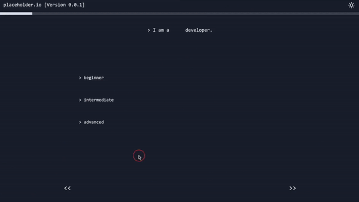

<div id="header" align="center">
  
</div>

# Placeholder.io

Placeholder.io is an online platform specifically designed for software developers to find 
mentors/mentees. 

The goal with placeholder is to provide a place where programmers of all levels, from complete beginners, to more advanced coders who are looking to learn a new technology, can find mentors who are willing to share their experience and knowledge through an ongoing dialogue.   

We’ve tried to create an aesthetic and UI which makes it clear that this is a location for developers, and that you’ve come to the right place if you’re looking to meet other programmers.


## Demo

<div>
  <p align="left">
    
    
    
  </p>
</div>

## Tech Stack

**Frontend:** React, Redux, Next.js, TypeScript, React Three Fiber, ChatEngine.io

**Backend:** Mongoose, MongoDB, NextAuth, Cloudinary


## Run Locally

To run the app locally, please make sure that you have [node.js](https://nodejs.dev/) installed, then use the following commands:

> Note: you will need to add environment variables to a .env file ([see below](https://github.com/giabertu/placeholder/main/README.md#environment-variables))

Clone the project

```bash
  git clone https://github.com/giabertu/placeholder.git
```

Go to the project directory

```bash
  cd placeholder
```

Install dependencies

```bash
  npm install
```

Start the application

```bash
  npm run dev
```


## Environment Variables

To run this project, you will need to add the following environment variables to your .env file

### Github Auth Credentials

`GITHUB_ID`

`GITHUB_SECRET`

### Google Auth Credentials

`GOOGLE_ID`

`GOOGLE_SECRET`

### Custom email Credentials

`EMAIL_SERVER_USER`

`EMAIL_SERVER_PASSWORD`

`EMAIL_SERVER_HOST`

`EMAIL_SERVER_PORT`

`EMAIL_FROM`

### Others

`NEXTAUTH_SECRET`

`SERVER`

`MONGODB_URI`

## Authors

- [Sau Ching Loke](https://github.com/coderomantics) | loke.sau.ching@gmail.com

- [Gianni Bertuzzi](https://github.com/giabertu) | giabertu99@gmail.com

- [Kiavash Shirazpour](https://github.com/Kio2047) | kiavash89@gmail.com
